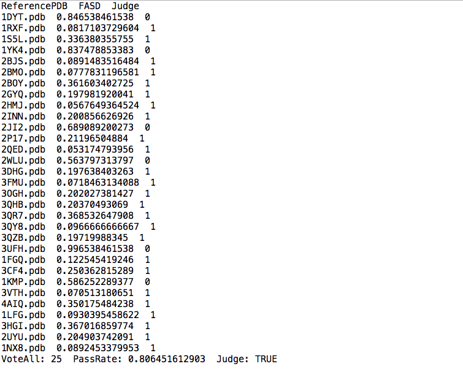

Copyright (C) 2019, Wei He (hwkobe.1027@gmail.com)


# mFASD: 

mFASD is a novel structure-based method for predicting certein type of metal binding sites including ZN, FE
CU, MN, CA, MG, etc. for any given protein region with known 3D structure.

If you use mFASD for your scientific research please cite the following publication:

**Wei He, Zhi Liang, Maikun Teng, Liwen Niu; mFASD: a structure-based algorithm for discriminating different types of metal-binding sites, Bioinformatics, Volume 31, Issue 12, 15 June 2015, Pages 1938–1944, https://doi.org/10.1093/bioinformatics/btv044**


## Installation

ProTiler is written in Python, Python2.7 is needed

### STEP1: Install Anaconda (highly recomended)
```console
wget https://repo.continuum.io/archive/Anaconda2-2018.12-Linux-x86_64.sh 
bash Anaconda2-2018.12-Linux-x86_64.sh 
```
### STEP2: Download mFASD package

#### Clone the git repo to your local directory through:
```consol
git clone https://github.com/MDhewei/mFASD.git
```
#### Or directly download the .zip package through:
https://github.com/MDhewei/mFASD/archive/master.zip


## Usage 

###  Arguments of the program:

#### Required arguments:

- -i/--input: 
     
     the PDB code for the query protein used for prediction. If a structure has no PDB code yet, user should 
     assign a temporal one.
 
 
- -m/--metal_type: 

     The metal type for which the user want to predict for given structures, mFASD now support prediction for
     six types of metals including CA,CU,FE,MN,MN and ZN.
 
 
- -r/--residue_list: 

     The residue list of certain protein region for metal prediction,eg:20,47,214
 
#### Optional arguments:

- -t1/--threshold1: 

     The threshold to determine whether two metal binding sites are similar,default=0.3
     
- -t2/--threshold2: 

     The threshold to determine the majority of votes',default=0.5

- -d/--pdb_directory: 

     The directory where the input protein structure are stored,default='PDBFiles'


- -o/--outputdir: 
     The output directory to save the result files',default='Output'
     


#### Example to run protiler call

```console
python mFASD.py -i 2HPI.pdb -m ZN -r 20,47,214
```


## Output

### mFASD output a .txt file recording all the voting results as following example:


